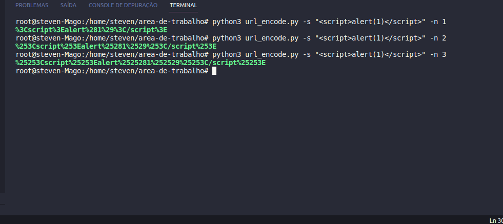

# Converte_url

</h1>Passe para o programa uma unica string ou um arquivo de payloads para converter</h1>
 
<h2>instalar=> pip install termcolor</h2>
 

<h3>Uso exemplo para string: python3 url_encode.py -s "> -n 3</h3>
 
<h3>Uso exemplo para wordlist.txt: python3 url_encode.py -w xss_good.txt -n 3 </h3>

 

